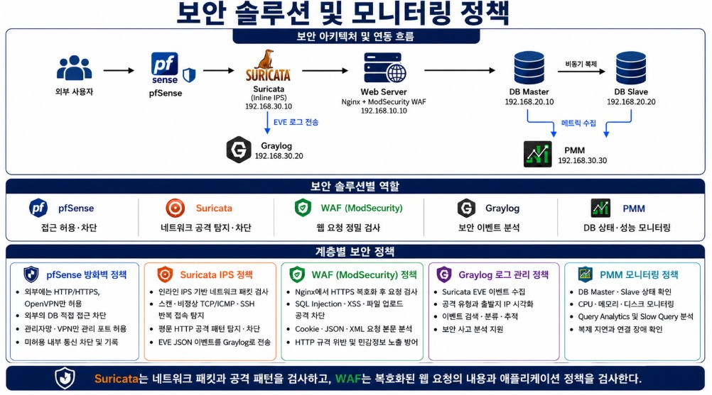
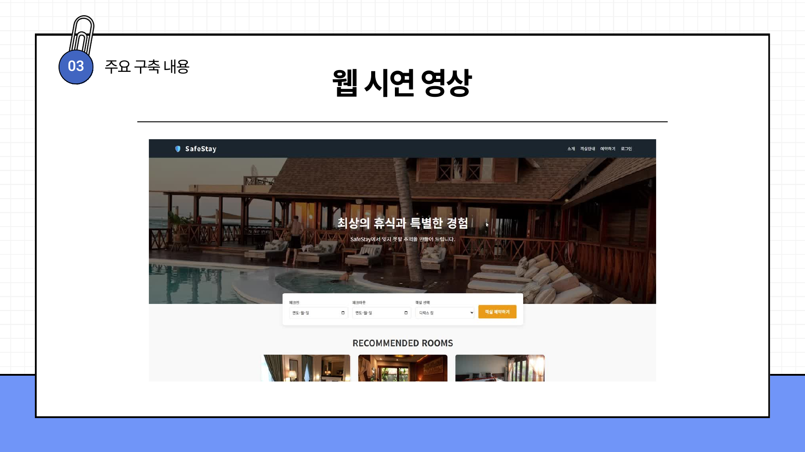
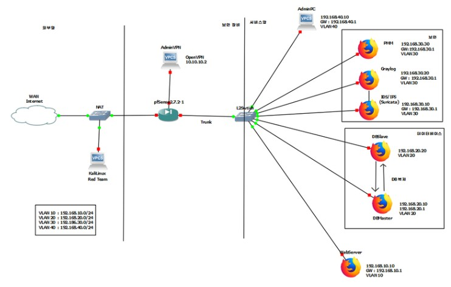
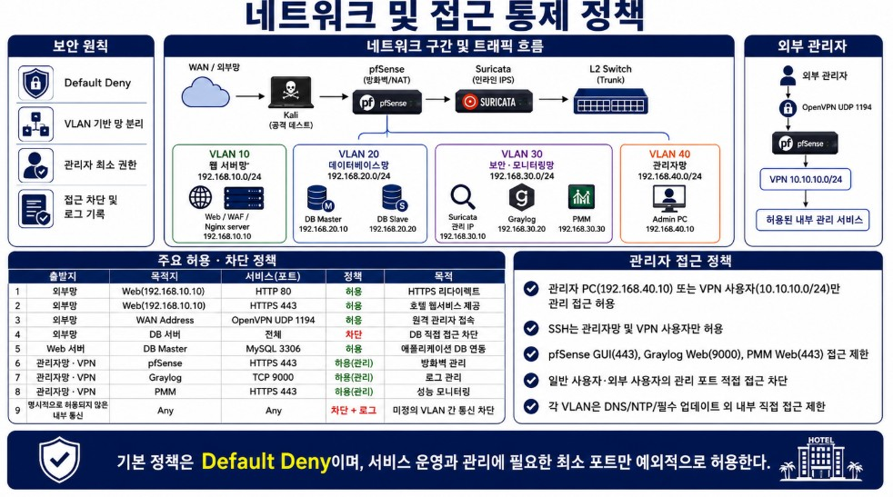
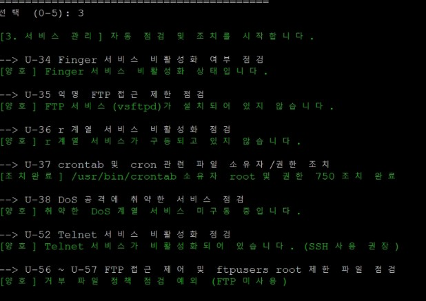
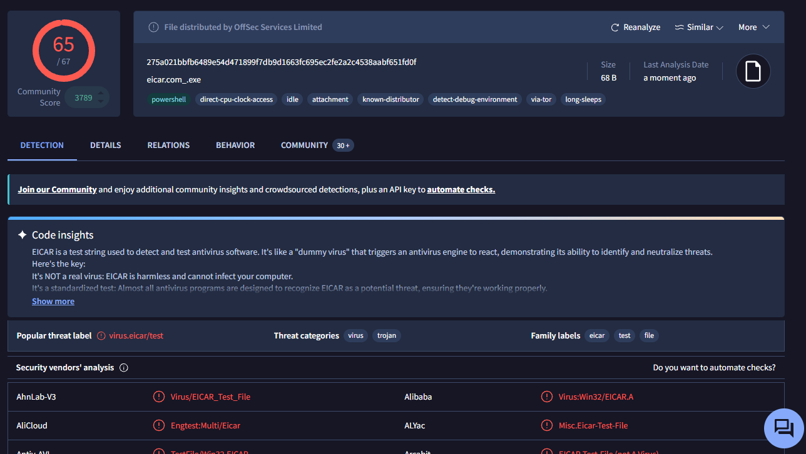
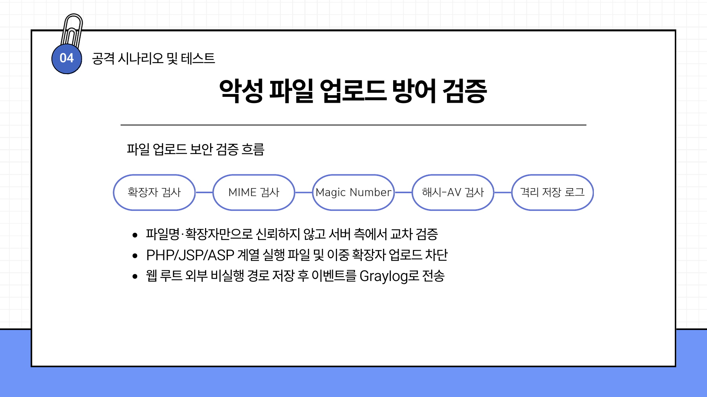
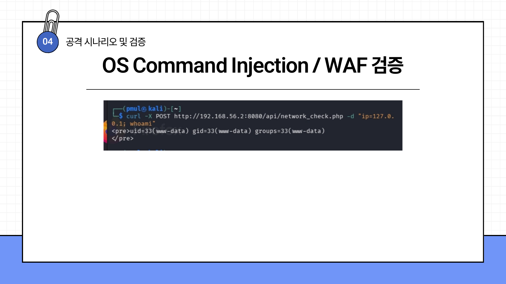
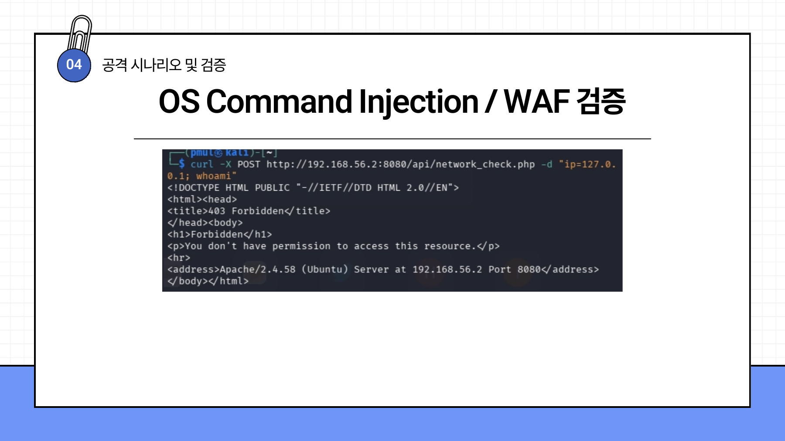
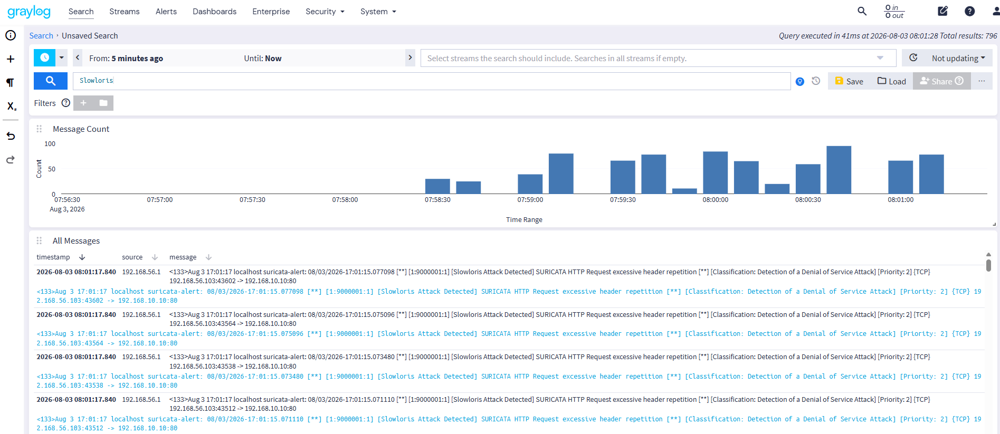

# SafeStay | 호텔 예약 시스템 보안 인프라

> 호텔 예약 서비스를 가정한 환경에서 VLAN 분리, 방화벽, IPS, WAF와 중앙 로그 분석을 결합한 팀 프로젝트입니다. 저는 DB Master–Slave·PMM 서버와 KISA 기준 보안 점검 스크립트, 악성 파일 분석을 맡았습니다.

| 항목 | 내용 |
| --- | --- |
| 기간 | 2026.07.23–08.05 |
| 팀 | 이스트캠프 가디언즈 3차 프로젝트 · 3줄 요약 좀 (5명) |
| 나의 역할 | 문경구 · DB/Slave, PMM, 보안 점검 Shell Script, 악성 파일 분석 |
| 프로젝트 형태 | 호텔 예약 웹서비스와 보안 관제 환경을 결합한 가상 실습 |

## 프로젝트 한눈에 보기

외부 사용자는 호텔 예약 웹서비스에 접근하고, 내부의 DB와 보안 관리 서비스는 필요한 경로에서만 접근하도록 설계했습니다. 공격은 pfSense의 네트워크 정책, Suricata의 패킷 검사, Web의 WAF를 거쳐야 합니다. 보안 이벤트는 Graylog에서 확인하고 DB 상태는 PMM으로 관찰하는 구조입니다.

계층별 구성과 역할. pfSense·IPS·WAF·Graylog·PMM은 서로 다른 계층을 담당합니다. 이 그림은 팀의 전체 설계이며 모든 구성 요소를 제가 단독 구현했다는 뜻은 아닙니다.

**핵심 목표:** 외부에서는 웹서비스 포트만 열고, Web에서 DB Master의 `3306` 포트만 접근하도록 제한합니다. 관리 서비스는 관리자망 또는 VPN 사용자에게만 허용합니다. 공격 요청 차단과 Suricata 이벤트 수집, DB 복제·장애 감지 상태를 확인하는 것이 결과보고서의 검증 목표였습니다.

## 서비스와 네트워크 구조

호텔 예약 웹화면은 숙소 조회·예약으로 이어지는 서비스 진입점입니다. 웹 구현과 WAF는 팀원의 작업이고, 저는 이 서비스가 사용하는 DB 계층과 상태 모니터링을 담당했습니다.

3차 결과보고서 13쪽의 웹 시연 화면. 예약 서비스가 실제로 표시된다는 근거이며, 외부 상용 운영·대규모 부하 성능을 입증하는 화면은 아닙니다.

| 구간 | 설계된 구성 | 접근 원칙 |
| --- | --- | --- |
| VLAN 10 · 웹 | `192.168.10.0/24`, Web/WAF `192.168.10.10` | 외부 HTTP는 HTTPS로 전환, 웹 요청은 IPS·WAF 검사 |
| VLAN 20 · DB | `192.168.20.0/24`, Master `192.168.20.10`, Slave `192.168.20.20` | Web의 DB 연결 등 필요한 흐름만 허용, 외부 직접 접근 차단 |
| VLAN 30 · 보안·모니터링 | `192.168.30.0/24`, Suricata·Graylog·PMM | IPS 이벤트 수집, 로그 분석, DB 지표 관찰 |
| VLAN 40 · 관리자 | `192.168.40.0/24`, 관리자 PC | 관리 페이지·SSH 등 운영 접근 제한 |
| VPN | OpenVPN 사용자망 `10.10.10.0/24` | 허용된 관리자에게 원격 관리 경로 제공 |

GNS3 기반 네트워크 연결도. 웹·DB·보안·관리 구간과 pfSense를 분리한 팀 토폴로지입니다. 네트워크 구성은 담당 팀원의 작업입니다.

pfSense 정책은 **Default Deny**를 기본으로 두고 HTTP/HTTPS, Web→DB, 관리자 VPN과 모니터링에 필요한 포트만 예외로 허용하도록 정리했습니다. 관리자 PC(`192.168.40.10`)와 VPN 사용자만 관리 서비스에 접근하고, 일반 사용자·외부 공격자의 관리 포트 직접 접근은 차단한다는 정책입니다.

네트워크·접근 통제 정책 요약. 정책표는 설계·구성의 근거이고, 각 규칙의 장기 운영 효과를 측정한 자료와는 구분합니다.

## 내가 맡은 구현

### 1. DB Master–Slave와 PMM

호텔 고객·예약 데이터를 저장하는 DB Master와 복제용 Slave를 구성하고, PMM(Percona Monitoring and Management) 서버를 담당했습니다. DB를 Web과 별도 VLAN에 두고 Web에서 필요한 `3306` 연결만 허용한다는 요구사항을 네트워크 담당자와 맞췄습니다. PMM은 DB의 성능·상태 지표를 보는 도구이고, **보안 로그 중앙 저장소는 Graylog**입니다.

- **복제:** 결과보고서는 DB Master–Slave 구성과 장애 감지 상태 확인을 검증 목표·구축 결과로 기록합니다. 구성도를 포함한 보고서에는 Master `192.168.20.10`과 Slave `192.168.20.20`의 관계가 표시돼 있습니다.
- **모니터링:** PMM으로 DB 성능·상태의 가시성을 확보하도록 했습니다. 팀의 GoAccess는 웹 접속 분석, Graylog는 보안 이벤트 검색을 맡아 지표의 목적을 나눴습니다.
- **검증 범위:** 보고서에는 자동 승격, 백업 복원, 재해복구 시험의 수치·절차가 없습니다. 실제로 DB 백업·재해복구 부재를 개선 항목으로 명시하므로, 복제 구성을 완전한 HA나 백업 체계로 표현하지 않았습니다.

### 2. KISA 기준 Linux 보안 점검 스크립트

계정·파일·서비스·패치·로그의 다섯 범주로 나눈 Shell Script를 작성했습니다. 결과보고서는 KISA 주요정보통신기반시설 가이드의 `U-01`–`U-67` 항목을 진단 대상으로 설명하고, 주요 파일·로그 권한에 대한 자동 조치를 성과로 기록합니다. 스크립트 화면에서는 선택한 항목의 정상/취약 판정과 조치 결과를 확인할 수 있습니다.

| 점검 범주 | 예시 항목 | 스크립트의 의도 |
| --- | --- | --- |
| 계정 관리 | root 원격 접속, 비밀번호·잠금 정책, UID·shell | 불필요한 권한·로그인 경로 확인 |
| 파일·디렉터리 | 중요 설정 파일 권한, SUID/SGID, UMASK | 파일 변조·과도한 쓰기 권한 축소 |
| 서비스 | Finger, 익명 FTP, r 계열, Telnet, crontab | 미사용·취약 서비스와 권한 확인 |
| 패치 | OS·커널 버전과 업데이트 상태 | 보안 패치 확인 |
| 로그 | 시각 동기화, rsyslog 정책, 로그 권한 | 추적 가능한 기록 유지 |

결과보고서의 서비스 관리 점검 화면. Finger·FTP·r 계열·Telnet 등의 상태와 crontab 권한 조치를 보여줍니다. 이 화면 하나로 `U-01`–`U-67` 전 항목이 모두 통과했다고 주장하지 않습니다.

### 3. 악성 파일 분석과 업로드 검증

악성 파일 분석에는 **EICAR 테스트 파일**을 사용했습니다. 해시·문자열·파일 특성을 확인하고 VirusTotal 결과를 대조해, 탐지기가 테스트 문자열에 반응하는지 살폈습니다. 결과보고서는 VirusTotal **65/67 탐지**를 기록합니다. EICAR는 실제 감염성 악성코드가 아니라 백신 동작 확인용 표준 테스트 파일입니다.

65/67 엔진 탐지 결과와 파일 식별 정보. 이 화면은 테스트 파일의 정적 분석 근거이며, 호텔 서버가 업로드를 차단했다는 직접 증거는 아닙니다.

팀은 파일 업로드 시 확장자에만 의존하지 않고 서버 측 MIME·Magic Number·해시·AV 검사를 거쳐, 허용 파일을 웹 루트 바깥의 비실행 경로에 저장하고 이벤트를 기록하는 흐름을 제시했습니다. 결과보고서는 실행형 확장자·이중 확장자 차단을 검증 항목으로 정리합니다.

3차 결과보고서 26쪽의 검사 흐름. 검증 단계의 설계를 설명하는 자료이며, 각 단계별 차단율이나 우회 테스트의 수치를 제공하지는 않습니다.

## 팀 공격 시나리오와 확인 결과

### OS Command Injection과 WAF

결과보고서에는 `network_check.php`에 명령어 페이로드를 전달했을 때 `www-data`가 반환된 **초기 노출 화면**과, 후속 요청에 **403 Forbidden**이 표시된 화면이 모두 남아 있습니다. 따라서 처음부터 차단됐다고 쓰지 않고, 취약 경로를 확인한 뒤 차단 설정을 검증한 순서로 기록했습니다.

3차 결과보고서 18쪽. 입력값이 서버 명령 실행으로 이어진 초기 테스트를 보여줍니다.

3차 결과보고서 19쪽. 보고서는 WAF 차단 성공으로 평가합니다. 화면만으로 403을 발생시킨 정확한 설정·계층까지 단정하지는 않습니다.

### Slowloris DoS와 IPS·Graylog

Slowloris 시나리오에서는 연결이 오래 유지되는 HTTP 요청을 발생시키고 웹 연결 상태와 Suricata 이벤트를 확인했습니다. 결과보고서는 IPS 대응을 성공으로 평가하며, Graylog 화면에는 `Slowloris Attack Detected` 이벤트가 반복 수집됩니다. 이는 **탐지 로그의 근거**이고 장시간 부하 시험이나 서비스 가용성 수치를 대신하지는 않습니다.

공격 요청 후 중앙 로그에서 탐지 이벤트를 조회한 화면. IPS의 패킷 차단 효과와 실제 서비스 지연은 별도 지표로 검증해야 합니다.

| 검증 항목 | 결과보고서의 기록 | 읽을 때의 범위 |
| --- | --- | --- |
| OS Command Injection | 초기 실행 결과 확인, 후속 403 응답; 보고서상 차단 성공 | 차단 원인의 세부 룰·재현 절차는 추가 검증 필요 |
| Slowloris DoS | 연결 증가 관찰, IPS 대응 성공 평가, Graylog 이벤트 수집 | 장기 부하·성능 회복 시간 측정 자료는 없음 |
| 파일 분석·업로드 | EICAR 65/67 탐지, 실행형/이중 확장자 차단 흐름 기술 | EICAR 탐지와 서버 업로드 차단은 서로 다른 검증 |
| 중앙 관제 | Suricata·웹·방화벽 이벤트의 수집을 결과로 정리 | Graylog가 로그 분석, PMM이 DB 지표 모니터링 담당 |

## 배운 점과 남은 과제

- **계층을 구분한 검증:** 웹 요청의 403, IPS 탐지 이벤트, Graylog 수집 결과는 각각 다른 질문에 답합니다. 단일 화면을 전체 보안 효과로 확대하지 않고 요청·차단·기록을 함께 확인해야 합니다.
- **복제와 복구의 차이:** DB 복제는 데이터 사본과 상태 관찰에 도움을 주지만 백업·복원·자동 장애 전환을 보장하지 않습니다. 다음에는 복구 목표와 장애 시나리오를 정해 실제 승격·복원 시험을 해야 합니다.
- **점검 자동화의 범위:** 스크립트는 반복 점검과 일부 조치를 줄였습니다. 모든 항목의 안전한 자동 조치, 예외 처리, 변경 전후 기록은 별도 개선이 필요합니다.

결과보고서의 후속 과제는 보안 장비의 단일 장애점, 관리 시스템 MFA·RBAC, **DB 백업·재해복구 부재**, 로그 보존 기간·용량 제한입니다. 이 항목을 현재 구현 성과로 표기하지 않았습니다.

**기술:** `Ubuntu 24.04` · `MariaDB` · `PMM` · `Shell Script` · `pfSense` · `OpenVPN` · `Suricata` · `Nginx/ModSecurity` · `Graylog` · `GoAccess` · `GNS3`

### 자료 기준

- Google Drive **3차 프로젝트 계획서.pdf**: 프로젝트 목표, 초기 아키텍처, 역할과 일정.
- Google Drive **3차 프로젝트 결과보고서.pdf**: 최종 역할(5쪽), 보안 구조(9–12쪽), 웹·스크립트(13–16쪽), 공격 검증(17–28쪽), 성과·한계(29–30쪽).
- Google Drive **호텔 예약 시스템 사진자료**: `p2-1`–`p2-6` 이미지 6장. 작업 공간의 동일 파일(이름·크기 일치)을 저장소에 복사했습니다.
- 결과보고서에서 추출한 이미지 4장: 웹 시연(13쪽), WAF 초기·후속 테스트(18–19쪽), 업로드 보안 흐름(26쪽).

계획서의 기대 효과와 결과보고서에 남은 시연·평가를 구분했습니다. 팀 전체 성과와 제가 맡은 DB·PMM·스크립트·악성 파일 분석 작업을 나눠 적었습니다.
